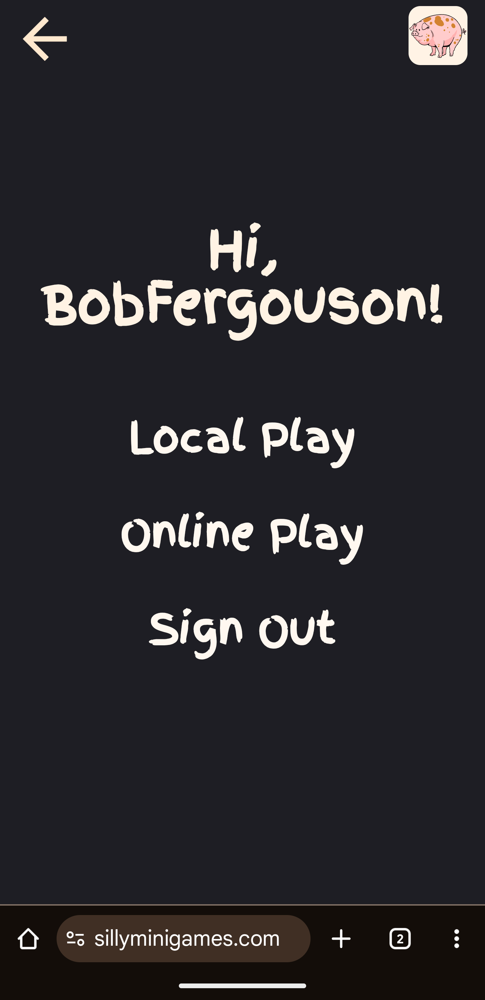
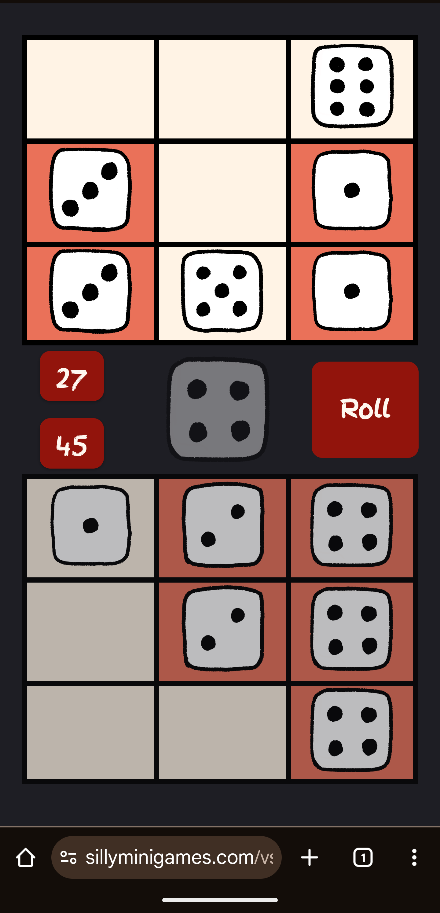
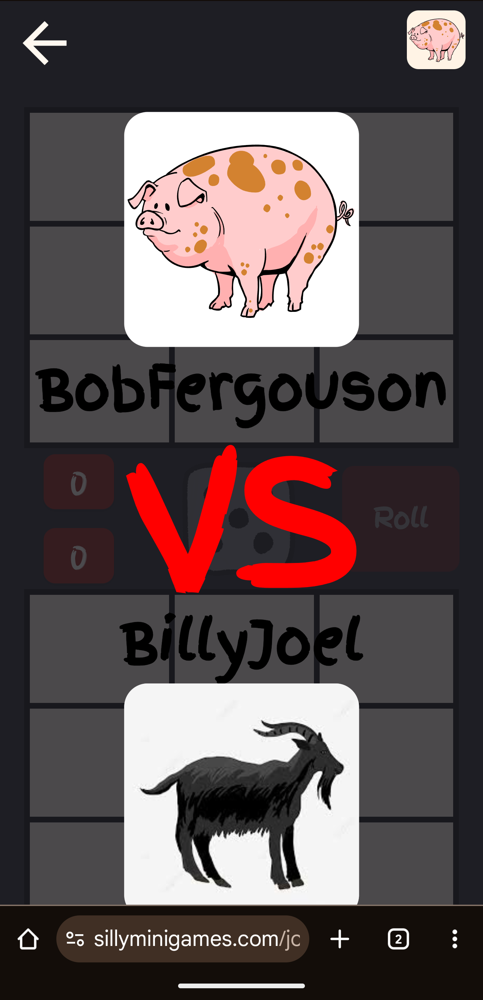
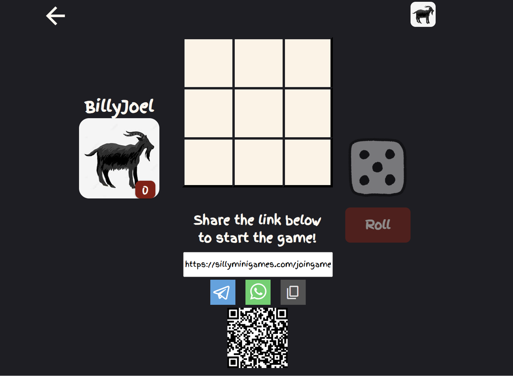
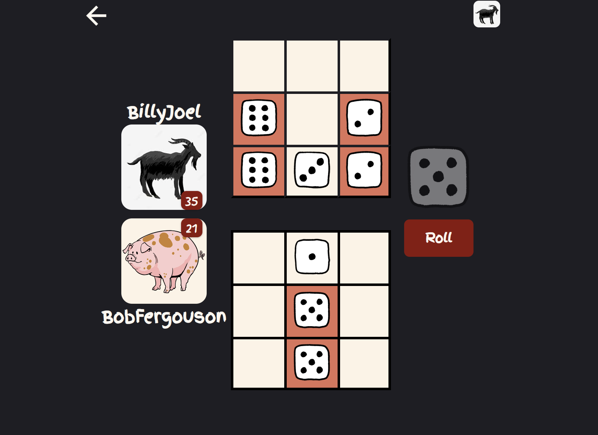

# Silly Mini Games - Frontend

This is the frontend of [Silly Mini Games](https://www.sillyminigames.com) written in React. Silly Mini Games is a game hub to play fun, simple, and lesser-known mini games with your friends! Currently only the game of Knucklebones is available, but more games are coming. Knucklebones is inspired by the dice game in the video game Cult of The Lamb.

## Motivation

I built the [Knucklebones backend](https://github.com/AradD7/Go-Knucklebones) but a simple CLI game wasn't going to be satisfying enough, so giving it a UI seemed like the only logical step forward! Since a good portion of the app is not related to the game logic, making the project a game hub for different games felt like a necessary shift.

## Screenshots

### Mobile

<table>
  <tr>
    <td></td>
    <td></td>
    <td></td>
  </tr>
  <tr>
    <td align="center">Main Menu</td>
    <td align="center">Gameplay</td>
    <td align="center">Online Game</td>
  </tr>
</table>

### Desktop

<table>
  <tr>
    <td></td>
    <td></td>
  </tr>
  <tr>
    <td align="center">New Game</td>
    <td align="center">Gameplay</td>
  </tr>
</table>

## Features

- 🎮 **Multiple Game Modes**
  - Local pass-and-play
  - Online multiplayer with real-time updates
  - Computer opponent (Easy, Medium, Hard)

- 🔐 **Authentication**
  - Sign up/Sign in with email
  - Google OAuth integration
  - Email verification system

- 👤 **Player Profiles**
  - Customizable display names
  - Avatar selection
  - Profile management

- ⚡ **Real-time Gameplay**
  - WebSocket connections for live updates
  - Instant game state synchronization

## Tech Stack

- **React** - UI framework
- **React Router** - Navigation
- **Vite** - Build tool
- **Axios** - HTTP client
- **Google OAuth** - Third-party authentication

## Prerequisites

- Node.js 18+ 
- npm or yarn

## Installation

1. Clone the repository:
```bash
git clone https://github.com/yourusername/silly-mini-games-frontend.git
cd silly-mini-games-frontend
```

2. Install dependencies:
```bash
npm install
```

3. Create a `.env` file in the root directory:
```env
VITE_BACKEND_URL=http://localhost:8080/api
VITE_GOOGLE_CLIENT_ID=your-google-client-id.apps.googleusercontent.com
```

4. Start the development server:
```bash
npm run dev
```

The app will be available at `http://localhost:5173` (or the port Vite assigns)

## Building for Production

```bash
npm run build
```

The build output will be in the `dist/` directory.

## Project Structure

```
.
├── src/
│   ├── api/
│   │   └── config.js          # Axios configuration & interceptors
│   ├── pages/
│   │   ├── MainMenu.jsx        # Home page
│   │   ├── Navbar.jsx          # Navigation component
│   │   ├── play/
│   │   │   ├── local/          # Local game mode
│   │   │   ├── online/         # Online multiplayer
│   │   │   └── computer/       # VS computer mode
│   │   ├── signin/             # Authentication pages
│   │   └── profile/            # Player profile
│   ├── components/
│   │   ├── LocalBoard.jsx      # Game board component
│   │   └── Instructions.jsx    # Game instructions
│   ├── utils.js                # Utility functions
│   └── index.jsx               # App entry point
├── .env                        # Environment variables
└── package.json
```

## Environment Variables

| Variable | Description | Example |
|----------|-------------|---------|
| `VITE_BACKEND_URL` | Backend API base URL | `http://localhost:8080/api` |
| `VITE_GOOGLE_CLIENT_ID` | Google OAuth Client ID | `123456-abc.apps.googleusercontent.com` |
| `VITE_WEBSOCKET_URL` | `ws://localhost:8080/ws/games/` |


## Available Routes

- `/` - Main menu
- `/localplay` - Local pass-and-play mode
- `/vscomputer?difficulty=easy|medium|hard` - Play against computer
- `/onlineplay` - Create/view online games
- `/joingame` - Join an online game
- `/profile` - Player profile
- `/signin` - Sign in page
- `/signup` - Sign up page
- `/verify` - Email verification page

## Authentication Flow

The app uses JWT-based authentication with automatic token refresh:

1. User signs in (email/password or Google OAuth)
2. Access token (60 min) and refresh token (7 days) stored in localStorage
3. Axios interceptor automatically adds access token to requests
4. On 401 errors, automatically refreshes token and retries request
5. If refresh fails, redirects to sign-in page

## API Integration

The frontend communicates with the [Go backend](https://github.com/AradD7/Go-Knucklebones). See the backend's [API documentation](https://github.com/AradD7/Go-Knucklebones/blob/main/API.md) for full endpoint details.

## Contributing

Contributions are welcome! Please feel free to submit a Pull Request.

## Related Projects

- [Backend Repository](https://github.com/AradD7/Go-Knucklebones) - Go backend with full API
